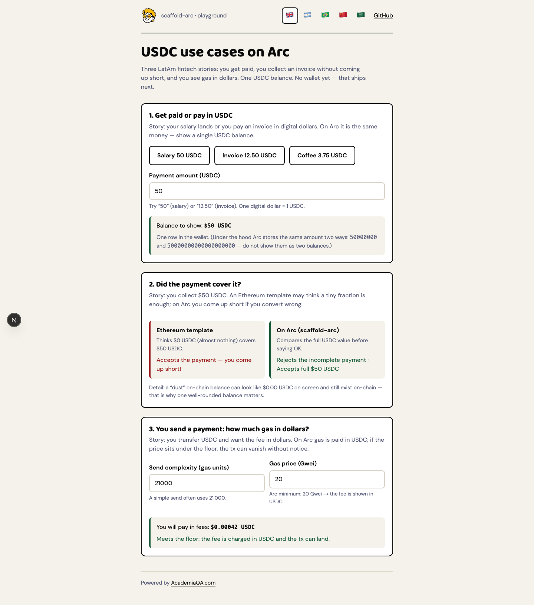
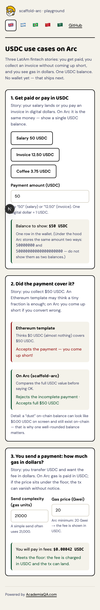

# scaffold-arc

**Powered by [AcademiaQA.com](https://academiaqa.com)**

---

## Para todos

### Qué es (en lenguaje simple)

**scaffold-arc** es un kit de arranque para construir apps en [Arc](https://docs.arc.io/), la blockchain de Circle donde el gas se paga en **USDC** (dólares digitales), no en ETH.

Si copiás un template de Ethereum “tal cual”, podés:

- ver **el doble de dinero** en pantalla (porque USDC se muestra de dos formas que son el mismo saldo), o
- mandar transacciones que **nunca aparecen** (porque Arc exige un mínimo de fee).

Este repo documenta esas trampas, las prueba con código, y te da una **pantalla sencilla** con historias de fintech LatAm — marca [Simonethg](https://simonethg.com) (mascota en el header, sin wordmark de nombre).

### Idiomas (selector de banderas)

En el header hay un switcher solo con banderas (`data-testid="locale-switcher"`). Locales:

| Código | Idioma |
|---|---|
| `en` | English |
| `es` | Español (Argentina) 🇦🇷 |
| `pt-BR` | Português (Brasil) |
| `zh` | 中文 |
| `ar` | العربية (RTL) |

El idioma se guarda en `localStorage`. Por defecto: `es` / `pt-BR` según el navegador, si no `en`.

### Capturas de la UI

Playground en `http://localhost:3000` (después de `yarn nextjs:dev`):





> Si las imágenes aún no están en el clone, mirá [`docs/screenshots/README.md`](docs/screenshots/README.md) para regenerarlas (desktop 1440 + móvil 390).

### Casos de uso en el playground (sin jerga)

| Historia en la UI | Qué aprendés |
|---|---|
| **Te pagan o pagás en USDC** | Sueldo 50 USDC, factura 12,50 USDC o un café: un **solo saldo** en dólares. |
| **¿Te alcanzó el pago?** | El template de Ethereum cree que alcanza con una fracción; en Arc te quedás corto si no convertís bien. |
| **Mandás un pago: ¿cuánto gas?** | El fee se muestra en **USDC / dólares**. Debajo del piso de 20 Gwei la tx puede desaparecer. |

Hoy **no hace falta wallet**: es una calculadora de prueba. Conectar MetaMask llega en el siguiente entregable.

---

## Para developers

### Quickstart

Requirements: Node 20+, Yarn, [Foundry](https://getfoundry.sh).

```bash
git clone https://github.com/Simonethg/scaffold-arc.git
cd scaffold-arc
yarn
yarn foundry:test      # 17 tests Solidity
yarn nextjs:dev        # UI → http://localhost:3000
```

Forge only:

```bash
yarn foundry:build
yarn foundry:test
```

### What exists today

```
packages/
├── foundry/    # UsdcUnits + Usdc libs, naive-port tests
├── nextjs/     # Simonethg playground (USDC conversion / naive / fee)
└── sdk/        # placeholder
deployments/    # canonical Arc addresses JSON
docs/screenshots/
```

Solidity:

- [`UsdcUnits`](packages/foundry/src/UsdcUnits.sol) — 18↔6 conversion
- [`Usdc`](packages/foundry/src/Usdc.sol) — balances, transfer guards, fee math
- [`NaiveEthereumPort`](packages/foundry/src/examples/NaiveEthereumPort.sol) — wrong patterns for tests only

UI: [`packages/nextjs`](packages/nextjs) — i18n playground (`en` / `es` / `pt-BR` / `zh` / `ar`), flag switcher, mascot header, `data-testid`, brand tokens from simonethg.com.

### Network details

| | Arc Mainnet | Arc Testnet |
|---|---|---|
| Chain ID | `5042` | `5042002` |
| RPC | `https://rpc.mainnet.arc.io` | `https://rpc.testnet.arc.io` |
| Explorer | [explorer.arc.io](https://explorer.arc.io) | [testnet.arcscan.app](https://testnet.arcscan.app) |
| Gas token | USDC (native 18d / ERC-20 6d) | same |
| Faucet | — | [faucet.circle.com](https://faucet.circle.com) |

Addresses: [`deployments/addresses.json`](deployments/addresses.json).

### Why your Ethereum template will not work

1. **USDC 18 vs 6 decimals — same funds.** Never mix `msg.value` with `balanceOf`. Never show two USDC rows.
2. **20 Gwei floor.** Below it, txs are silently dropped.
3. **Value to `address(0)` / blocklist / self-destruct burns revert** on Arc.
4. **No onchain randomness** (`PREVRANDAO` = 0); finality &lt; 1s.

Full reference: [Arc EVM differences](https://docs.arc.io/arc/references/evm-differences).

### Roadmap

- [x] D1 — Monorepo, Arc config, footguns README
- [x] D2 — `Usdc.sol` + naive-port tests
- [x] UI playground (Simonethg) for USDC math / fee floor
- [x] i18n: `en`, `es`, `pt-BR`, `zh`, `ar` (RTL) + flag-only locale switcher
- [ ] D3 — wagmi wallet + single USDC balance
- [ ] D4 — gas helper in SDK
- [ ] D5 — MemoPayment example
- [ ] D6 — Mainnet CREATE2 + verify
- [ ] D7 — v0.1 GitHub Template
- [ ] v0.2 — batch pay, arc:pay, revoke, CI + axe
- [ ] v0.3 — EAS + splits

### Testing & accessibility

- Contracts: `yarn foundry:test`
- UI: `data-testid` primary; axe-core scoped to component at 390 px and 1440 px (critical/serious block merge). Automated axe CI arrives with v0.2.

### License

[MIT](LICENSE)

**Powered by [AcademiaQA.com](https://academiaqa.com)**
